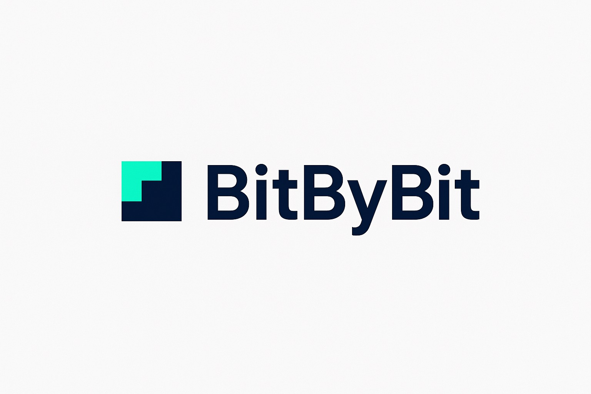

---

<h1 align="center">Documentazione</h1>

*Repository per la documentazione di progetto*

*Università di Padova* 

*Facoltà di informatica - Corso di Ingegneria del software a.a. 2025-26*

## Contenuto
Il repository è composto dalle seguenti cartelle:

- **candidatura:** documenti rlativi alla presentazione della candidatura quali,
  - documento principale riassuntivo,
  - documento preventivo costi e rischi attesi, 
  - documento motivazioni scelta dei capitolati.
- **verbali esterni:** documenti narrativi redatti dagli incontri del gruppo con le aziende propenenti esterne.
- **verbali interni:** documenti narrativi redatti dagli incontri incontri tra i componenti del gruppo.

## Componenti del gruppo
| Nominativo | Matricola |
| ---------- | --------- |
| Dennis Parolin  | 2113203 |
| Ferdinando Fracasso | 2122649 |
| Giovanni Visentin | 2101064 |
| Riccardo Manisi   | 2111948 |
| Marco Sanguin  | 2103121 |
| Gabriele Scaggiante  | 2101076 |

## Contatti
**Email:** swe.bitbybit@gmail.com
